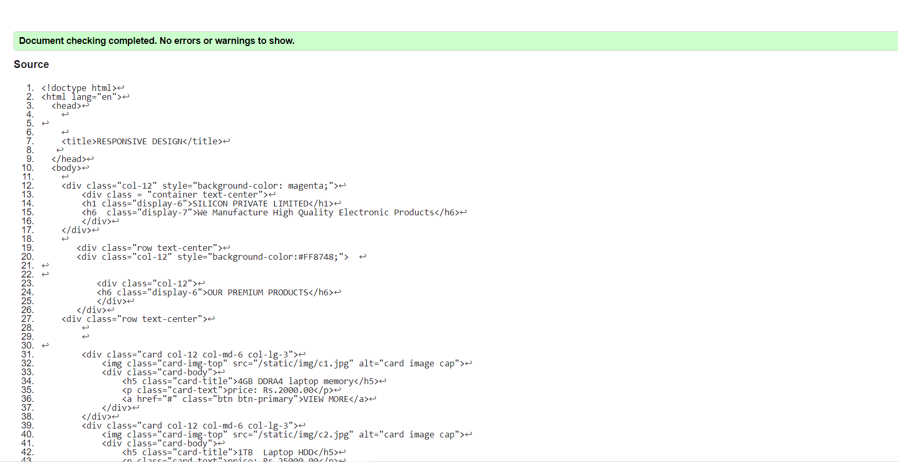

# Design of Responsive Website
## AIM:
To design a responsive website with two break points.

## DESIGN STEPS:
### Step 1: 
Requirement collection.
### Step 2:
Creating the layout using HTML and CSS.
### Step 3:
Updating the sample content.
### Step 4:
Choose the appropriate style and color scheme.
### Step 5:
Validate the layout in various browsers.
### Step 6:
Validate the HTML code.
### Step 7:
Create a database model and migrate the database.
### Step 8:
Retrieve data from database and display it in a dynamic webpage.
### Step 9:
Publish the website in the given URL.

## PROGRAM:

### HOME HTML:

```
<!doctype html>
<html lang="en">

<head>
    <!-- Required meta tags -->
    <meta charset="utf-8">
    <meta name="viewport" content="width=device-width, initial-scale=1, shrink-to-fit=no">

    <!-- Bootstrap CSS -->
    <link rel="stylesheet" href="https://maxcdn.bootstrapcdn.com/bootstrap/4.0.0/css/bootstrap.min.css"
        integrity="sha384-Gn5384xqQ1aoWXA+058RXPxPg6fy4IWvTNh0E263XmFcJlSAwiGgFAW/dAiS6JXm" crossorigin="anonymous">
    <title>Responsive Aboutus Design</title>
</head>

<body>
    <div class="jumbotron">
        <div class="container text-center">
            <h1 class="display-3">Silicon Private Limited</h1>
            <h5 class="display-6">We Manufacture High Quality Electronic Products</h5>
        </div>
        
    </div>
    <div class="homecontent">    
    <h1>About Us</h1>
    
    <div class="contenttext">
    Silicon Pvt Ltd, provides a broad range of semiconductor and infrastructure software applications that serve the data center, networking, software, broadband, wireless, and storage and industrial markets. Common applications for its products include: data center networking, home connectivity, broadband access, telecommunications equipment, smartphones, base stations, data center servers and storage, factory automation, power generation and alternative energy systems, displays, and mainframe operations and management, and application software development. Some of Silicon's core technologies and products include:
    <ul>
        <li>Memory Chips</li>
        <li>SATA HDD</li>
        <li>SATA SSD </li>
        <li>Broadband Modems</li>
        <li>Wifi Devices</li>
        <li>Switching Devices</li>
        <li>Optical Sensors</li>
    </ul> 
    </div>
    </div>
    <div class="row text-center">
        <div class="col-12 ">
            <p>Copyright © 2021 Silicon Private Limited, Developed by PRIYADARSHINI.</p>
        </div>
    </div>
   


    <!-- Optional JavaScript -->
    <!-- jQuery first, then Popper.js, then Bootstrap JS -->
    <script src="https://code.jquery.com/jquery-3.2.1.slim.min.js"
        integrity="sha384-KJ3o2DKtIkvYIK3UENzmM7KCkRr/rE9/Qpg6aAZGJwFDMVNA/GpGFF93hXpG5KkN"
        crossorigin="anonymous"></script>
    <script src="https://cdnjs.cloudflare.com/ajax/libs/popper.js/1.12.9/umd/popper.min.js"
        integrity="sha384-ApNbgh9B+Y1QKtv3Rn7W3mgPxhU9K/ScQsAP7hUibX39j7fakFPskvXusvfa0b4Q"
        crossorigin="anonymous"></script>
    <script src="https://maxcdn.bootstrapcdn.com/bootstrap/4.0.0/js/bootstrap.min.js"
        integrity="sha384-JZR6Spejh4U02d8jOt6vLEHfe/JQGiRRSQQxSfFWpi1MquVdAyjUar5+76PVCmYl"
        crossorigin="anonymous"></script>

</body>

</html>

```
### PRODUCT HTML:

```

<!doctype html>
<html lang="en">
  <head>
    <!-- Required meta tags -->
    <meta charset="utf-8">
    <meta name="viewport" content="width=device-width, initial-scale=1, shrink-to-fit=no">

    <!-- Bootstrap CSS -->
    <link rel="stylesheet" href="https://maxcdn.bootstrapcdn.com/bootstrap/4.0.0/css/bootstrap.min.css" integrity="sha384-Gn5384xqQ1aoWXA+058RXPxPg6fy4IWvTNh0E263XmFcJlSAwiGgFAW/dAiS6JXm" crossorigin="anonymous">

    <title>RESPONSIVE DESIGN</title>
   
  </head>
  <body>
    
    <div class="col-12" style="background-color: magenta;">
        <div class = "container text-center">
        <b><h1 class="display-6">SILICON PRIVATE LIMITED</h1></b>
        <h6  class="display-7">We Manufacture High Quality Electronic Products</h6>
        </div>
    </div>
    <div class="container">
     <div class="col-12" style="background-color:#30FFFE;">  
        <div class = "row text-center">
       <div class = "col-12 "><a href="/homes">HOME</a></div>
       <div class = "col-12 "><a href="/products">PRODUCTS</a></div>
       <div class = "col-12 "><a href="/peoples">PEOPLE</a></div>
       <div class = "col-12 "><a href="/contactus">CONTACT US</a></div>
       </div>
       <div class="row text-center">
       <div class="col-12" style="background-color:#FF8748;">  


           <div class="col-12">
           <h6 class="display-6">OUR PREMIUM PRODUCTS</h6>
           </div>
       </div>
    <div class="row text-center">
        
        

        <div class="card col-12 col-md-6 col-lg-3">
            
            <div class="card-body">
                <h5 class="card-title">4GB DDRA4 laptop memory</h5>
                <p class="card-text">price: Rs.2000.00</p>
                <a href="#" class="btn btn-primary">VIEW MORE</a>
            </div>
        </div>
        <div class="card col-12 col-md-6 col-lg-3">
            
            <div class="card-body">
                <h5 class="card-title">1TB  Laptop HDD</h5>
                <p class="card-text">price: Rs.25000.00</p>
                <a href="#" class="btn btn-primary">VIEW MORE</a>
            </div>
        </div>
        <div class="card col-12 col-md-6 col-lg-3">
            
            <div class="card-body">
                <h5 class="card-title">KK Moon 1.8in Micro SATA to SATA 2.5 SSD Hard Drive Disk</h5>
                <p class="card-text">price: Rs.45000.00</p>
                <a href="#" class="btn btn-primary">VIEW MORE</a>
            </div>
        </div>
        <div class="card col-12 col-md-6 col-lg-3">
            
            <div class="card-body">
                <h5 class="card-title">XCLUMA ESP32 ESP-32S ESP 32 Development Board Bluetooth</h5>
                <p class="card-text">price: Rs.6000.00</p>
                <a href="#" class="btn btn-primary">VIEW MORE</a>
            </div>
        </div>
        <div class="card col-12 col-md-6 col-lg-3">
            
            <div class="card-body">
                <h5 class="card-title">ADATA AD4U2400J4G17 -R 4GB 2400 MHZ DDR4 - U - DIMM RAM</h5>
                <p class="card-text">price: Rs.9000.00</p>
                <a href="#" class="btn btn-primary">VIEW MORE</a>
            </div>
        </div>
        <div class="card col-12 col-md-6 col-lg-3">
            
            <div class="card-body">
                <h5 class="card-title">Quantum QHM0 USB wireless wifi Adapter</h5>
                <p class="card-text">price: Rs.90000.00</p>
                <a href="#" class="btn btn-primary">VIEW MORE</a>
            </div>
        </div>
        <div class="card col-12 col-md-6 col-lg-3">
            
            <div class="card-body">
                <h5 class="card-title">ZEBRONICS H81 LGA 1150 Socket MotherBoard</h5>
                <p class="card-text">price: Rs.20000.00</p>
                <a href="#" class="btn btn-primary">VIEW MORE</a>
            </div>
        </div>
        <div class="card col-12 col-md-6 col-lg-3">
            
            <div class="card-body">
                <h5 class="card-title">ADATA 4GB DDRA4 2666 Laptop Memory</h5>
                <p class="card-text">price: Rs.40000.00</p>
                <a href="#" class="btn btn-primary">VIEW MORE</a>
            </div>
        </div>
        
    </div>
    <div class="row text-center>
        
        <div class="col-12 text-center">
            <p>Copyright © 2021 Silicon Private Limited, Developed by PRIYADARSHINI.</p>
        </div>
        </div>
    </div>
    

    <!-- Optional JavaScript -->
    <!-- jQuery first, then Popper.js, then Bootstrap JS -->
    <script src="https://code.jquery.com/jquery-3.2.1.slim.min.js" integrity="sha384-KJ3o2DKtIkvYIK3UENzmM7KCkRr/rE9/Qpg6aAZGJwFDMVNA/GpGFF93hXpG5KkN" crossorigin="anonymous"></script>
    <script src="https://cdnjs.cloudflare.com/ajax/libs/popper.js/1.12.9/umd/popper.min.js" integrity="sha384-ApNbgh9B+Y1QKtv3Rn7W3mgPxhU9K/ScQsAP7hUibX39j7fakFPskvXusvfa0b4Q" crossorigin="anonymous"></script>
    <script src="https://maxcdn.bootstrapcdn.com/bootstrap/4.0.0/js/bootstrap.min.js" integrity="sha384-JZR6Spejh4U02d8jOt6vLEHfe/JQGiRRSQQxSfFWpi1MquVdAyjUar5+76PVCmYl" crossorigin="anonymous"></script>
  
  </div>
  </body>
</html>

```

### PEOPLE HTML:
```
<!doctype html>
<html lang="en">
  <head>
    <!-- Required meta tags -->
    <meta charset="utf-8">
    <meta name="viewport" content="width=device-width, initial-scale=1, shrink-to-fit=no">

    <!-- Bootstrap CSS -->
    <link rel="stylesheet" href="https://maxcdn.bootstrapcdn.com/bootstrap/4.0.0/css/bootstrap.min.css" integrity="sha384-Gn5384xqQ1aoWXA+058RXPxPg6fy4IWvTNh0E263XmFcJlSAwiGgFAW/dAiS6JXm" crossorigin="anonymous">

    <title>RESPONSIVE PEOPLE DESIGN</title>
   
  </head>
  <body>
    <div class="jumbotron">
        <div class = "container text-center">
        <h1 class="display-6">SILICON PRIVATE LIMITED</h1>
        <h6  class="display-7">We Manufacture High Quality Electronic Products</h6>
        </div>
    </div>
    <div class="container">
        
       <div class="row text-center">
           <div class="col-12">
           <h6 class="display-6">PEOPLES</h6>
           </div>
       </div>
    <div class="row text-center">
        <div class="card col-12 ">
            
            <div class="card-body">
                <h5 class="card-title">JOHN</h5>
                <p class="card-text">CEO</p>
                
            </div>
        </div>
        <div class="card col-12 ">
            
            <div class="card-body">
                <h5 class="card-title">MARY</h5>
                <p class="card-text">SALES ASSOCIATE</p>
                
            </div>
        </div>
        <div class="card col-12 ">
            
            <div class="card-body">
                <h5 class="card-title">GEMMA</h5>
                <p class="card-text">SALES MANAGER</p>
               
            </div>
        </div>
        <div class="card col-12 ">
            
            <div class="card-body">
                <h5 class="card-title">SMITH</h5>
                <p class="card-text">ACCOUNT MANAGER</p>
                
            </div>
        </div>
        <div class="card col-12 ">
            
            <div class="card-body">
                <h5 class="card-title">TOBIAS</h5>
                <p class="card-text">ADMINISTRATIVE ASSISTANT</p>
                
            </div>
        </div>
        <div class="card col-12 ">
            
            <div class="card-body">
                <h5 class="card-title">MAYA</h5>
                <p class="card-text">EMPLOYEE</p>
               
            </div>
        </div>
        
        
    </div>
    <div class="row">
        <div class="col-12 text-center">
            <p>Copyright © 2021 Silicon Private Limited, Developed by PRIYADARSHINI.</p>
        </div>
    </div>
    </div>
    </div>

    <!-- Optional JavaScript -->
    <!-- jQuery first, then Popper.js, then Bootstrap JS -->
    <script src="https://code.jquery.com/jquery-3.2.1.slim.min.js" integrity="sha384-KJ3o2DKtIkvYIK3UENzmM7KCkRr/rE9/Qpg6aAZGJwFDMVNA/GpGFF93hXpG5KkN" crossorigin="anonymous"></script>
    <script src="https://cdnjs.cloudflare.com/ajax/libs/popper.js/1.12.9/umd/popper.min.js" integrity="sha384-ApNbgh9B+Y1QKtv3Rn7W3mgPxhU9K/ScQsAP7hUibX39j7fakFPskvXusvfa0b4Q" crossorigin="anonymous"></script>
    <script src="https://maxcdn.bootstrapcdn.com/bootstrap/4.0.0/js/bootstrap.min.js" integrity="sha384-JZR6Spejh4U02d8jOt6vLEHfe/JQGiRRSQQxSfFWpi1MquVdAyjUar5+76PVCmYl" crossorigin="anonymous"></script>
  </body>
</html>

```

### CONTACTUS HTML:

```
<!doctype html>
<html lang="en">

<head>
    <!-- Required meta tags -->
    <meta charset="utf-8">
    <meta name="viewport" content="width=device-width, initial-scale=1, shrink-to-fit=no">

    <!-- Bootstrap CSS -->
    <link rel="stylesheet" href="https://maxcdn.bootstrapcdn.com/bootstrap/4.0.0/css/bootstrap.min.css"
        integrity="sha384-Gn5384xqQ1aoWXA+058RXPxPg6fy4IWvTNh0E263XmFcJlSAwiGgFAW/dAiS6JXm" crossorigin="anonymous">
    <title>Responsive Contactus Design</title>   
</head>

<body>
    <div class="jumbotron">
        <div class="container text-center">
            <h1 class="display-3">Silicon Private Limited</h1>
            <h5 class="display-6">We Manufacture High Quality Electronic Products</h5>
        </div>
    </div>

    <div class="contactuscontent">
    <h1>CONTACT US</h1>
    <div class="contactustext text-center">
       <h1> GEMMA (SALES MANAGER)</h1>
            <h2>ADDRESS : KG Campus, 365, Thudiyalur Rd, Saravanampatti, Keeranatham, Tamil Nadu, India - 641035</h2>
            <h3>PHONE :0422 - 441 9999</h3>
            <h4>EMAIL : siliconlimited@gmail.com</h4>
    </div>
    <div class="row">
        <div class="col-12 text-center">
            <p>Copyright © 2021 Silicon Private Limited, Developed by PRIYADARSHINI.</p>
        </div>
    </div>
</div>


    <!-- Optional JavaScript -->
    <!-- jQuery first, then Popper.js, then Bootstrap JS -->
    <script src="https://code.jquery.com/jquery-3.2.1.slim.min.js"
        integrity="sha384-KJ3o2DKtIkvYIK3UENzmM7KCkRr/rE9/Qpg6aAZGJwFDMVNA/GpGFF93hXpG5KkN"
        crossorigin="anonymous"></script>
    <script src="https://cdnjs.cloudflare.com/ajax/libs/popper.js/1.12.9/umd/popper.min.js"
        integrity="sha384-ApNbgh9B+Y1QKtv3Rn7W3mgPxhU9K/ScQsAP7hUibX39j7fakFPskvXusvfa0b4Q"
        crossorigin="anonymous"></script>
    <script src="https://maxcdn.bootstrapcdn.com/bootstrap/4.0.0/js/bootstrap.min.js"
        integrity="sha384-JZR6Spejh4U02d8jOt6vLEHfe/JQGiRRSQQxSfFWpi1MquVdAyjUar5+76PVCmYl"
        crossorigin="anonymous"></script>

</body>

</html>

```


## OUTPUT:


## REPORT:





## RESULT:
    Thus a Website is designed for the chip manufacturing company and is hosted in the URL http://priyadarshini.student.saveetha.in:8000/products/ . HTML code is validated.